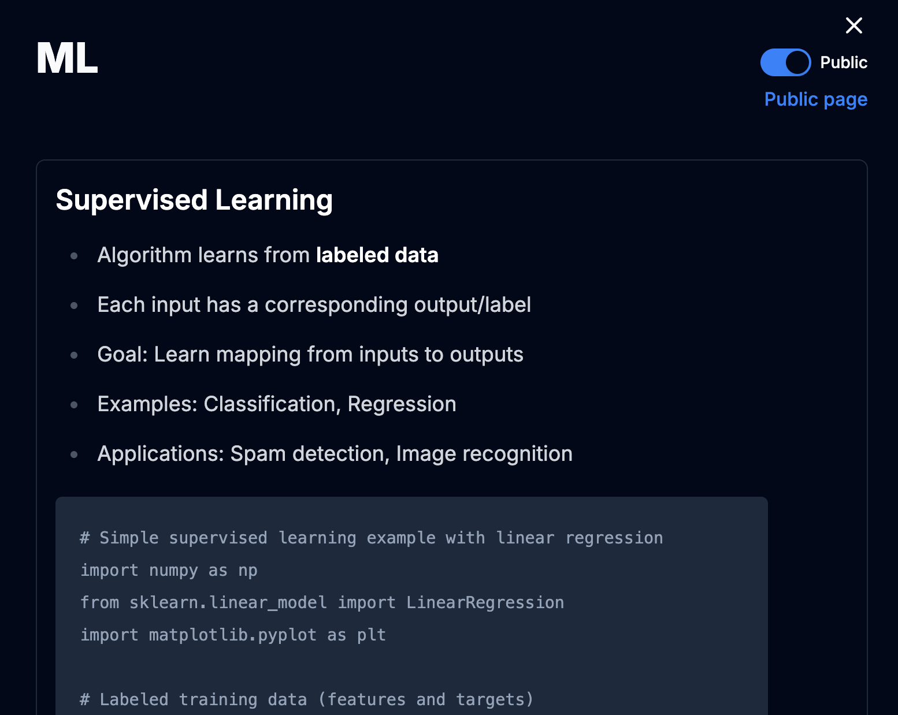

<!-- PROJECT LOGO -->
 

  <!--  -->

  <h3 align="center">Learning Journal</h3>

  

    Keep your learning on track!
     
    <a href="https://share-learn.com"><strong>Visit site »</strong></a>
  

<!-- TABLE OF CONTENTS -->

  
Table of Contents

  <ol>
    <li>
      <a href="#about-the-project">About The Project</a>
      <ul>
        <li><a href="#built-with">Built With</a></li>
      </ul>
    </li>
    <li><a href="#roadmap">Roadmap</a></li>
    <li><a href="#license">License</a></li>
    <li><a href="#acknowledgments">Acknowledgments</a></li>
  </ol>

<!-- ABOUT THE PROJECT -->

## About The Project

Learning Journal was born from a desire for a tool that can track topic based learning progress and provide encouragment for continued learning.

Basics:

- Categories and topics provide organization for topic based learning
- Notion style editor and drag and drop blocks allow you to record you learnings for the day. Add another day's learnings the next time you revisit the topic
- Make learnings public when you're ready to share!

### Built With

- 
- 
- 
- 

(<a href="#readme-top">back to top</a>)

<!-- ROADMAP -->

## Roadmap

- [] Branding
- [] Reminder notifications

See the [open issues](https://github.com/johnjoseph3/LearningJournal/issues) for a full list of proposed features (and known issues).

(<a href="#readme-top">back to top</a>)

<!-- LICENSE -->

## License

Distributed under the GNU GENERAL PUBLIC LICENSE. See [LICENSE](LICENSE) for more information.

(<a href="#readme-top">back to top</a>)

<!-- ACKNOWLEDGMENTS -->

## Acknowledgments

- [NextAuth.js](https://github.com/nextauthjs/next-auth-example)
- [dnd kit](https://dndkit.com/)
- [Novel](https://novel.sh/)

(<a href="#readme-top">back to top</a>)

